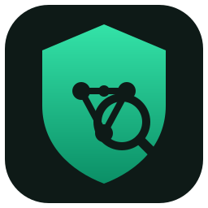
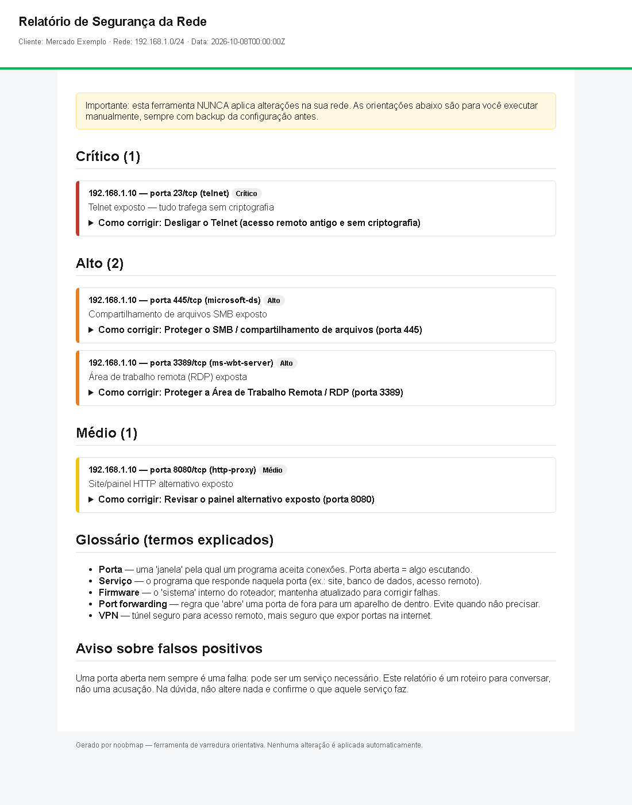

<p align="center">
  
</p>

<h1 align="center">noobmap</h1>

<p align="center"><strong>Segurança de rede básica, explicada para leigos — rodando no Kali Live (pendrive), sem instalar nada.</strong></p>

<p align="center">
  <a href="LICENSE"></a>
  
  
  <a href="https://github.com/l7hmarque/noobmap/actions/workflows/ci.yml"></a>
</p>

<p align="center">
  🇧🇷 <strong>Português</strong> · <a href="README.en.md">🇬🇧 English</a>
</p>

---

**noobmap** é uma ferramenta de linha de comando que faz uma **varredura de segurança básica**
na sua rede doméstica ou do seu comércio e gera um **relatório em linguagem simples**, com um
**passo a passo de correção** que qualquer pessoa consegue seguir.

A ideia é simples: **todo mundo merece uma segurança mínima** — e isso não precisa ser
complicado nem caro. Você dá boot no **Kali Live** por um pendrive (*não* instala nada),
roda um comando e recebe um relatório que diz **o que está exposto** e **como fechar essa porta**.

> ⚠️ **Use apenas com autorização.** Escanear rede de terceiros sem permissão é ilegal.
> A ferramenta **exige** que você confirme a autorização escrita e, sem isso, **não roda**.

### 📋 Índice

- [O que ele faz (e o que **não** faz)](#o-que-ele-faz-e-o-que-não-faz)
- [Como funciona](#como-funciona)
- [Preparativos: Kali Live no pendrive](#preparativos-kali-live-no-pendrive)
- [Uso](#uso)
- [Exemplo de relatório](#exemplo-de-relatório)
- [Limitações (transparência)](#limitações-transparência)
- [Estrutura do projeto](#estrutura-do-projeto)
- [Testes](#testes)
- [Contribuir](#contribuir)
- [Licença](#licença)

### O que ele faz (e o que **não** faz)

✅ **Faz**
- Descobre **quais aparelhos** estão na rede e **quais portas/serviços** estão abertos.
- Identifica **serviços de risco** comuns: Telnet, SMB, RDP, VNC, bancos de dados expostos
  (MySQL, PostgreSQL, SQL Server, Oracle, MongoDB, Redis, Elasticsearch, Memcached), API do
  Docker exposta, WinRM, Jupyter, NFS e serviços remotos antigos (rsh/rlogin/rexec).
- Marca cada achado por **gravidade**: Crítico → Alto → Médio → Baixo → Informativo.
- Gera um **relatório HTML offline** (abre sem internet) + um resumo no terminal.
- Para cada achado, dá um passo a passo: **onde ir, o que mudar e o que NÃO mexer**.

🚫 **Não faz**
- **Não explora falhas** (nenhum Metasploit, nenhuma invasão).
- **Não lê tráfego criptografado** nem captura senhas.
- **Não altera nada** na sua rede: apenas **orienta** — *você* aplica as mudanças.
- Não avalia **wi-fi**, celulares, phishing ou malware local.
- Não substitui um pentest profissional (veja [Limitações](#limitações-transparência)).

### Como funciona

```
Autorização (RoE) → Varredura Nmap → Análise + Gravidade → Relatório HTML → Correções → Re-scan
```

Diagramas interativos (abra no navegador):
- [Visão geral — como o noobmap funciona](docs/diagramas/noobmap-como-funciona.html)
- [Por dentro — do comando nmap ao relatório](docs/diagramas/noobmap-por-dentro.html)

O motor é o **[Nmap](https://nmap.org/)** (já vem no Kali), chamado com opções **conservadoras**:

| Opção | O que faz |
|---|---|
| `-sV` | descobre a **versão** de cada serviço |
| `--top-ports 100` | varre só os **100 serviços mais comuns** |
| `-Pn` | varre mesmo se o aparelho **bloquear ping** |
| `-T3` | **ritmo moderado**, não sobrecarrega a rede |
| `-oX` | salva o resultado bruto em **XML** (evidência) |
| *(sem `--script`)* | **nenhum** teste de exploração/invasão |

O noobmap só aceita **redes privadas** (`10.x`, `172.16–31.x`, `192.168.x`) e no máximo **/24 (254 aparelhos)**.

### Preparativos: Kali Live no pendrive

1. **Pendrive** de 8 GB+ e um programa para gravá-lo: [Rufus](https://rufus.ie/) (Windows) ou [balenaEtcher](https://etcher.balena.io/) (qualquer SO).
2. Baixe a ISO do **Kali Linux Live** em [kali.org/get-kali](https://www.kali.org/get-kali/) (opção *Live Boot*).
3. Grave a ISO no pendrive (isso **apaga** o pendrive).
4. Dê **boot pelo pendrive** (tecla de boot: `F12`, `F2`, `DEL`, `ESC`… depende da marca).
5. Escolha a opção **"Live system"** (não instala nada no computador).

O passo a passo detalhado (com o que fazer em cada tela) está em **[docs/TUTORIAL.md](docs/TUTORIAL.md)**.

### Uso

No terminal do Kali Live, dentro da pasta do noobmap:

```bash
chmod +x noobmap
./noobmap --version

# 1) Faça o cliente ler e assinar o termo: docs/roe/termo-de-autorizacao.md
# 2) Rode a varredura (troque pelo nome e pela rede dele):
./noobmap scan --autorizado --cliente "Mercado do Zé" --rede 192.168.1.0/24
```

Saída em `noobmap-out/<cliente>/<data>/`:
- `relatorio.html` — o documento para o cliente (abra no navegador).
- `nmap_bruto.xml` — dado técnico (guarde como evidência).
- `autorizacao.json` — prova de que havia autorização.

Sem `--autorizado`, a ferramenta **aborta** com código 3 e não escaneia nada.

### Exemplo de relatório

<p align="center">
  
</p>

### Limitações (transparência)

O noobmap é uma **linha de base** — a "segurança mínima que todos deveriam ter". Ele:
- cobre **~30 serviços comuns** de forma **genérica** (a orientação serve para a maioria dos roteadores, com um espaço para o seu modelo específico);
- é **advisory-only**: encontra exposição e orienta; **não** garante que a rede ficou 100% segura;
- **não** substitui **atualização de firmware**, **gestão de senhas**, **antivírus** e **educação do usuário**.

Ele **reduz bastante** o risco de ataques remotos automatizados comuns (**se** as correções forem aplicadas), mas **0-days, phishing e falhas locais ficam de fora**. Dito isso, uma rede sem essa checagem está exposta a problemas que **deveriam** estar fechados.

### Estrutura do projeto

```
noobmap            # comando (wrapper bash)
pyproject.toml
src/noobmap/       # cli, authorization, scan, findings, remediation, report, storage, pipeline
tests/             # 71 testes (unittest)
scripts/           # build_release.py, canary.py, audit.py
docs/              # TUTORIAL, FAQ, diagramas, termo RoE, ADRs
```

### Testes

```bash
PYTHONPATH=src python -m unittest discover -s tests     # 71 testes, sem dependências externas
python scripts/build_release.py                          # gera dist/noobmap-<versão>.zip + checksum
python scripts/canary.py                                 # checagens de saúde
python scripts/audit.py                                  # testes + invariantes
```

### Contribuir

Leia **[CONTRIBUTING.md](CONTRIBUTING.md)**. Ideias muito bem-vindas: **orientações de correção para modelos de roteador específicos** (Mikrotik, TP-Link, Intelbras, Ubiquiti…), novas regras de gravidade e traduções.

### Licença

**[MIT](LICENSE)** — use, estude, modifique e compartilhe.

---

<p align="center"><a href="README.en.md">🇬🇧 Read this in English →</a></p>
